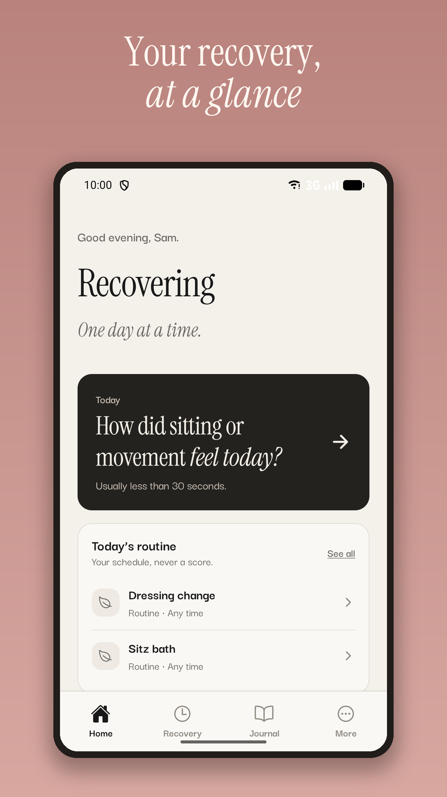
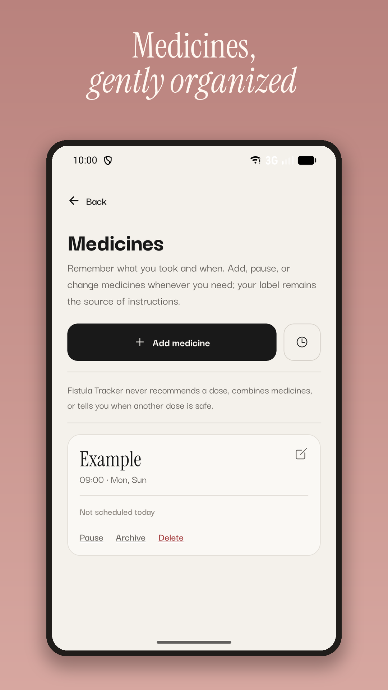
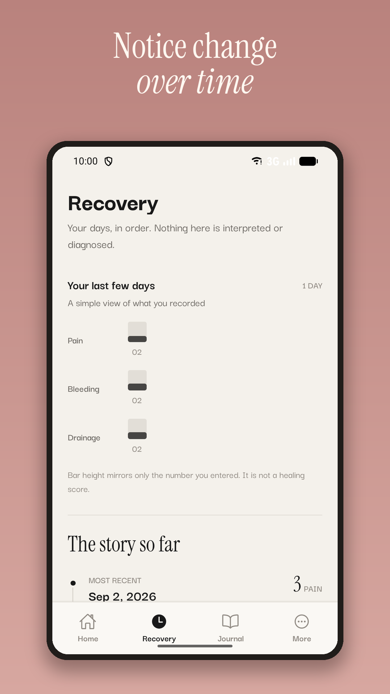
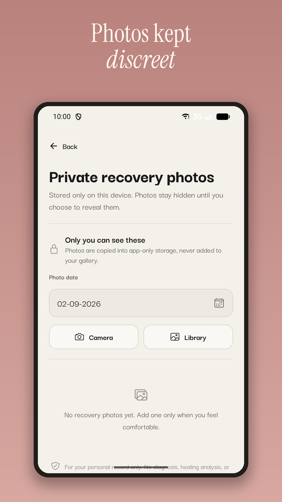

# Fistula Tracker


An Android-first, local-first companion for keeping the practical parts of anal fistula recovery organized in one private place.

[**Download the latest Android APK**](https://github.com/sidbfz/fistula-tracker/releases/latest/download/Fistula-Tracker-1.0.2.apk)

> The Google Play production listing is still pending, so this build is distributed directly through GitHub. Android may ask you to allow installation from your browser or Files app. The APK is release-signed; only download it from this repository's Releases page.

## Video demo

[](https://www.youtube.com/watch?v=yNceIYF8Y7w)

[**Watch the demo on YouTube**](https://www.youtube.com/watch?v=yNceIYF8Y7w)

## What it helps with

- Daily recovery check-ins and an editable recovery timeline
- Medicine schedules, local reminders, and Taken/Skipped/Postponed history
- A private wound-photo timeline stored inside the app's local storage
- A recovery journal and a personal “When I recover” list
- A customizable routine and recovery essentials checklist
- Optional device authentication and complete local-data deletion
- Optional one-time support through RevenueCat; every recovery feature stays free

## Screenshots

<p align="center">
  
  
  
</p>
<p align="center">
  
  
  
</p>

## Privacy by design

- No account, backend, cloud sync, remote health storage, or health-data analytics
- Structured recovery data is stored in the on-device `recovery.db` SQLite database
- Wound photos are copied into the app-private document directory
- Local device notifications are used for reminders; no remote push token is requested
- Settings can permanently delete structured data, reminders, and private photos
- Purchases use an anonymous RevenueCat identifier; recovery records, medicine names, journal entries, reminders, and photos are never sent with a purchase

Read the complete [privacy policy](PRIVACY_POLICY.md).

## Important medical notice

Fistula Tracker is a personal organization tool, not a diagnostic or medical-advice service. It does not analyze photos, detect infection, score healing, decide whether recovery is normal, recommend treatment, calculate a safe next dose, or replace advice from a qualified healthcare professional.

## Built with

- Expo 54 and React Native
- TypeScript and Expo Router
- Expo SQLite for on-device structured data
- Expo Notifications for local reminders
- RevenueCat for optional one-time support

## Run locally

Requirements: Node.js, npm, and an Android development environment.

```bash
npm install
npm run android
```

Expo Go can exercise most flows and RevenueCat's preview purchase API. Real Google Play purchases require a native Android development or release build.

## Environment setup

Copy `.env.example` to `.env.local` and add your RevenueCat public SDK key. Never commit local environment files or signing credentials.

For RevenueCat, create the non-consumable product `fistula_tracker_one_time_support`, attach it to the `supporter` entitlement, and add it to the `default` offering using the predefined Lifetime package type. “Lifetime” is RevenueCat's technical package category; the app presents it as one-time support.

## Verification

```bash
npm run verify
```

The verification command runs the automated tests, TypeScript checks, linting, Expo dependency alignment checks, and Expo Doctor.
